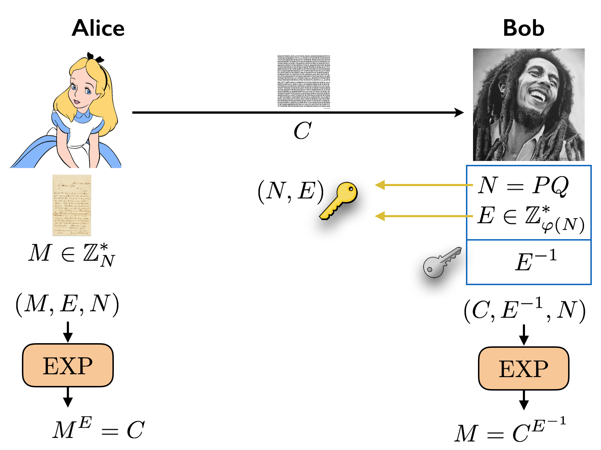

# MẬT MÃ KHÓA CÔNG KHAI RSA

## 1.  TỔNG QUAN

###  1.1. Mật mã đối xứng (Symmetric Cryptography)

Trước khi RSA ra đời, thế giới chủ yếu dùng mật mã đối xứng (như mã Caesar, AES).

- Nguyên lý: Dùng cùng một khóa (secret key) để đóng (mã hóa) và mở (giải mã).
- Vấn đề: Làm sao để hai người chưa từng gặp nhau (ví dụ: Bạn và Server Facebook) thống nhất được khóa bí mật này mà không bị hacker nghe lén giữa đường? Đây gọi là bài toán Trao đổi khóa.

### 1.2. Giải pháp: Mật mã bất đối xứng (Asymmetric Cryptography)

Năm 1977, Rivest, Shamir và Adleman (RSA) đã công bố thuật toán giải quyết vấn đề này.

- Nguyên lý: Mỗi người có một cặp khóa:

    1. Public Key (Khóa công khai): Công khai cho cả thế giới biết. Dùng để Mã hóa.

    2. Private Key (Khóa bí mật): Giữ kỹ, không cho ai biết. Dùng để Giải mã.

- Ví dụ trực quan:

---

## 2: CƠ SỞ TOÁN HỌC 

### 2.1. Số nguyên tố

- Là số tự nhiên lớn hơn 1 chỉ chia hết cho 1 và chính nó.

- RSA dựa trên việc: Nhân hai số nguyên tố lớn thì dễ, nhưng từ tích số đó tìm lại hai số ban đầu (phân tích thừa số nguyên tố) là CỰC KỲ KHÓ -> thuật toán hiệu quả nhất cho đến nay vẫn là brute-force.

### 2.2. Đồng dư thức (Modular Arithmetic)

Phép toán $a \pmod n$ là lấy số dư của $a$ khi chia cho $n$.
- Quy tắc lũy thừa: $(a^b) \pmod n = ((a \pmod n)^b) \pmod n$.

### 2.3. Ước chung lớn nhất (GCD) và Số nguyên tố cùng nhau

- Hai số $a$ và $b$ gọi là nguyên tố cùng nhau nếu $\text{gcd}(a, b) = 1$.

### 2.4. Hàm Euler (Euler's Totient Function - $\phi$)

- $\phi(n)$ là số lượng các số nguyên dương nhỏ hơn $n$ và nguyên tố cùng nhau với $n$.

- Công thức: Nếu $n$ là tích của hai số nguyên tố $p$ và $q$ ($n = p \times q$), thì:

$$\phi(n) = (p - 1) \times (q - 1)$$

### 2.5. Nghịch đảo modulo (Modular Inverse)

- Số $d$ là nghịch đảo của $e$ theo modulo $\phi(n)$ nếu:

$$e \times d \equiv 1 \pmod{\phi(n)}$$

- Điều kiện tồn tại $d$: $\text{gcd}(e, \phi(n)) = 1$.

---

## 3: THUẬT TOÁN RSA 

Quy trình RSA gồm 3 bước: Tạo khóa, Mã hóa và Giải mã.

### BƯỚC 1: Tạo khóa (Key Generation)

Alice muốn nhận tin nhắn bí mật, Alice thực hiện:

1. **Chọn ngẫu nhiên** 2 số nguyên tố lớn khác nhau $p$ và $q$.

2. **Tính Modulus**: Tính $n = p \times q$.

    - $n$ sẽ được dùng làm module cho cả khóa công khai và bí mật.

    - Độ dài của $n$ (tính bằng bit) chính là độ dài khóa (ví dụ RSA-1024, RSA-2048).

3. **Tính Hàm Euler**: Tính $\phi(n) = (p-1)(q-1)$.

4. **Chọn Khóa công khai** ($e$):

    - Chọn một số nguyên $e$ sao cho $1 < e < \phi(n)$ và $\text{gcd}(e, \phi(n)) = 1$.

    - Thực tế: Người ta thường chọn $e = 65537$ ($2^{16} + 1$) vì nó là số nguyên tố và tối ưu cho việc tính toán nhị phân.

5. **Tính Khóa bí mật** ($d$):

    - Tính $d$ sao cho $d \equiv e^{-1} \pmod{\phi(n)}$.

    - Tức là tìm $d$ để $(d \times e) \ chia \ \phi(n) \ dư \ 1$.

Sử dụng thuật toán Euclid mở rộng (Extended Euclidean) để tìm $d$.

**KẾT QUẢ:**

- **Public Key**: $(e, n)$ -> Gửi cho mọi người.
- **Private Key**: $(d, n)$ -> Giữ bí mật tuyệt đối.

**BƯỚC 2: Mã hóa (Encryption)**

Bob muốn gửi tin nhắn $M$ (dạng số) cho Alice:

1. Bob lấy Public Key của Alice $(e, n)$.

2. Chuyển tin nhắn thành số nguyên $M$ (với điều kiện $0 \le M < n$).

3. Tính bản mã $C$:

$$C = M^e \pmod n$$

4. Gửi $C$ cho Alice.

**BƯỚC 3: Giải mã (Decryption)**

Alice nhận được $C$:

1. Alice dùng Private Key $(d, n)$.

2. Tính lại tin nhắn gốc $M$:

$$M = C^d \pmod n$$
--- 
## 4: Ứng dụng. 

- **Bảo mật giao dịch trực tuyến**: Mã hóa thông tin thẻ tín dụng, dữ liệu thanh toán, và xác thực người dùng trong ngân hàng điện tử (e-banking) và thương mại điện tử (e-commerce).
- **Chữ ký số**: Tạo chữ ký điện tử cho hợp đồng, văn bản, và giao dịch số để đảm bảo tính xác thực, chống giả mạo (phù hợp với các tiêu chuẩn như GDPR, PCI DSS).
- **Bảo mật kênh truyền (SSL/TLS)**: Mã hóa dữ liệu truyền tải giữa trình duyệt và máy chủ web (HTTPS), bảo vệ các cuộc trò chuyện, email và VPN khỏi bị nghe lén.
- **Xác thực đa yếu tố (MFA)**: Cung cấp mã một lần (OTP), mã QR, hoặc sinh trắc học để xác nhận danh tính người dùng khi đăng nhập vào các hệ thống quan trọng (ví dụ: ứng dụng RSA Authenticator).
- **Bảo mật hệ thống**: Bảo vệ thông tin cá nhân, tài liệu mật quốc gia, và dữ liệu nhạy cảm được lưu trữ và xử lý trong các hệ thống công nghệ thông tin.
- **Ứng dụng trong lập trình**: Được tích hợp vào code Java và các ngôn ngữ khác để tăng cường bảo mật cho ứng dụng và trang web. 

## 5. Missions. 

- Cryptohack: 
    + set 1: RSA Starter 1 - 5
    + set 2: 
        - factoring
        - inferius prime
        - monoprime
        - square eyes
        - manyprimes
        - salty
        - modulus inutlilis
    + set 3:
        - Endless Email
        - infinite descent
        - everythings is big
        - cross wired

- Dreamhack:    
    + special_rsa_parameter 
    + Emoji RSA 

- Bonus: 
	- AlpacaHack Round 12 - Crypto
    - HTB Cyber Apocalypse 2025 - crypto_twin_oracles
    - RAS - KMA recruitment. 
    - RAS - Wanna champion 2024. 

---

## References

[1] https://www.ams.org/notices/199902/boneh.pdf

[2] https://doi.org/10.1080/09720529.2018.1564201

[3] Factor-tools: http://factordb.com |  https://www.alpertron.com.ar/ECM.HTM

[4] https://hackmd.io/@tranminhprvt01/RSA_Training_WCO2
