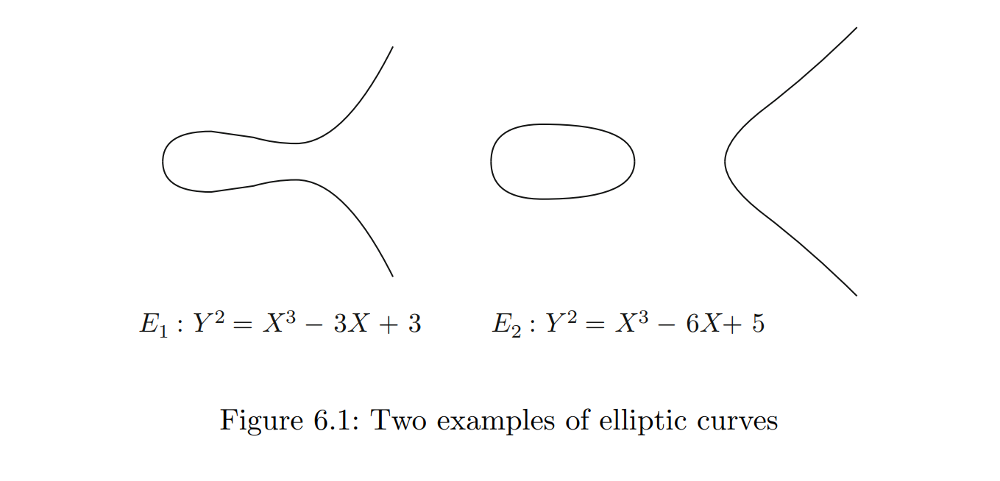

# Elliptic Curve Cryptography
Elliptic Curve Cryptography được đề xuất sử dụng bởi Neal Koblitz và Victor S. Miller vào năm 1985, sau đó được sử dụng rộng rãi từ năm 2004. Bài viết này sẽ cho các bạn những kiến thức nền tảng liên quan và mở rộng để hiểu rõ và áp dụng ECC trong thực tiễn (bảo mật web (HTTPS/TLS), tiền điện tử (Bitcoin, Ethereum), trao đổi khóa an toàn (ECDH), chữ ký số, và thiết bị di động/IoT).
## Elliptic Curve
Một đường cong Elliptic là tập hợp các nghiệm của phương trình có dạng:
$$Y^2 = X^3 + AX + B$$
với điều kiện $4A^3 + 27B^2 \ne 0$. Tương đương, đa thức $X^3 + AX + B$ có các nghiệm khác nhau. Điều này đảm bảo rằng đường cong không suy biến. Không suy biến (Non-singular) có nghĩa là đường cong không có điểm nhọn (cusps) hoặc điểm tự giao nhau (self-intersections), đảm bảo có tiếp tuyến xác định tại mọi điểm. Các đường cong này tạo thành một [abelian group](https://en.wikipedia.org/wiki/Abelian_group).

Phương trình dạng này được gọi là *Weierstrass equations*. Dưới đây là hai ví dụ về đường cong elliptic:



Ngoài ra còn có một số dạng khác của đường cong Elliptic như: 
- [Hessian curve](https://en.wikipedia.org/wiki/Hessian_form_of_an_elliptic_curve): $X^3 + Y^3 + Z^3 -kXYZ = 0$
- [Edwards curve](https://en.wikipedia.org/wiki/Edwards_curve): $x^2 + y^2 = 1 + dx^2y^2 $
- ...

Bạn có thể tham khảo thêm tại [đây](https://en.wikipedia.org/wiki/Elliptic_curve#Alternative_representations_of_elliptic_curves).

Cách xây dựng đường cong Elliptic trong Sagemath:
```python
from sage.all import *
p = 65535
F = GF(p) # Construct finite field
E = EllipticCurve(F, [-3, 3]) #(E): Y^2 = X^3 + -3X + 3
```

Đường cong Elliptic có thể có các điểm với tọa độ trong bất kỳ trường nào, chẳng hạn như $\mathbb{F}_p, \mathbb{Q}, \mathbb{R}, \mathbb{C}$.

Một đường cong Elliptic trong trường hữu hạn $\mathbb{F}_p$ ($p$ là số nguyên tố) là tập hợp các điểm $(X, Y)$ với $X, Y \in \mathbb{F}_p$ nằm trên đường cong $(E)$, với $(E)$ được xác định như sau: $(E):Y^2 = X^3 + AX + B \pmod p$

Kí hiệu đường cong Elliptic trong trường hữu hạn là $E(\mathbb{F}_p)$.
Do nằm trong trường hữu hạn, nên số lượng điểm $(X, Y)$ của $(E)$ cũng là một số hữu hạn, ta gọi giá trị này là **order của curve**, kí hiệu là $\#E(\mathbb{F}_p)$

```python
from sage.all import *
E = EllipticCurve(GF(65535), [-3, 3]) #(E): Y^2 = X^3 + -3X + 3
n = E.order() #Get order of curve
```

Ta có thể xem tập hợp các điểm trên đường cong $(E)$ với phép tính $+$ tạo thành 1 nhóm abelian group.
Khi đó, E có những nguyên tắc cộng như sau:
1. **Đồng nhất thức [Identity]**: Tồn tại phần tử trung hòa $\mathcal{O} \in (E)$ sao cho $P + \mathcal{O} = \mathcal{O} + P = P, \forall P \in E$.
2. **Tính nghịch đảo [Inverse]**: Với mỗi phần tử $P \in (E)$, tồn tại phần tử nghịch đảo $Q = -P \in (E)$ sao cho: $P + Q = Q + P = \mathcal{O}$.
3. **Tính kết hợp [Associative]**: $(P + Q) + R = P + (Q + R), \forall P, Q, R \in (E)$
4. **Tính giao hoán [Commutative]**: $P + Q = Q + P, \forall P, Q \in (E)$.

Tiếp theo, ta sẽ đến với thuật toán cộng trên đường cong Elliptic:

Với $(E): Y^2 = X^3 + AX + B$ là đường cong elliptic bất kì, với hai điểm $P_1 = (x_1, y_1), P_2 = (x_2, y_2)$ nằm trên $(E)$, ta có các công thức sau:

- Nếu $P_1 = \mathcal{O}$ thì $P_1 + P_2 = P_2$, tương tự với $P_2$
- Nếu $x_1 = x_2, y_1 = -y_2$ thì $P_1 + P_2 = \mathcal{O}$
- Nếu như $P_1, P_2$ không nằm trong các trường hợp trên, ta định nghĩa $\lambda$ như sau:
$$\lambda = \begin{cases} \dfrac{y_2 - y_1}{x_2 - x_1} &\ if \ P_1 \ne P_2 \\ \dfrac{3x_1^2 + A}{2y_1} &\ if \ P_1 = P_2 \end{cases}$$
Khi đó, $P_1 + P_2 = (x_3, y_3)$, với:
$$x_3 = \lambda^2 - x_1 - x_2 \\ y_3 = \lambda(x_1 - x_3) - y_1$$

Vậy để nhân một điểm với một số $k \in \mathbb{F}_p$, ta thực hiện nhân đôi và cộng điểm liên tục tùy vào tính chẵn lẻ của $n$ sau mỗi lần biến đổi.

Đó là thuật toán `double-and-add` cho đường cong Elliptic. Cụ thể như sau:

Cho điểm $P \in E(\mathbb{F}_p)$ và số nguyên $n \ge 1$
1. Đặt $Q = P$ và $R = \mathcal{O}$
2. Lặp đến khi $n > 0$:
    - Nếu $n\equiv 1\pmod 2$, cho $R = R + Q$.
    - Cho $Q = 2Q$ và $n = \lfloor \dfrac{n}{2} \rfloor$.
    - Nếu $n > 0$, tiếp tục vòng lặp tại bước 2.
3. Trả về điểm $R$, lúc này $R = nP$

> Chú ý: $\mathcal{O} = n * P$, với $n = \#E(\mathbb{F}_p)$. Từ đó, nếu $a * P + b * P = c * P$, ta có thể hiểu là $a + b = c \mod n$

Vì phép cộng và nhân đã được tích hợp sẵn trên sagemath nên ta có thể tận dụng nó luôn:
```python
from sage.all import *
E = EllipticCurve(GF(65535), [-3, 3]) #(E): Y^2 = X^3 + -3X + 3
P = E.random_point() #Get a random point in (E)
Q = E.random_point() #Get another random point in (E)
n = E.order() #Get order of curve
print(P + Q)
print(2007 * P)
print(n * Q)
```

## Elliptic Curve Discrete Logarithm Problem (ECDLP)
Ở bài trước, mình đã nói về DLP (Discrete Logarithm Problem) trong trường hữu hạn $\mathbb{F}^*_p$. Để tạo ra một hệ mật mã dựa trên DLP cho $\mathbb{F}^*_p$, Alice công bố hai số $g$ và $h$, và khóa riêng của Alice là số mũ x trong phương trình đồng dư: $h\equiv g^x \pmod p$.

Bây giờ, Alice có thể làm điều tương tự với 1 đường cong Elliptic E qua $\mathbb{F}_p$:

> Cho đường cong $(E):Y^2 = X^3 + AX + B \mod p$ và 2 điểm $P, Q \in (E)$. ECDLP là vấn đề tìm kiếm giá trị $n \in \mathbb{F}_p$ sao cho $Q = nP$. Ta có thể viết $n = log_P(Q)$ và n là Logarit rời rạc Elliptic của Q đối với P.

Tuy nguyên tắc cộng trên đường cong Elliptic được ký hiệu là dấu cộng đơn giản, phép cộng trên E là một quy trình phức tạp. Vì vậy, dạng Elliptic của bài toán Logarit rời rạc này khá khó giải.

## Các mô hình tấn công
Bạn có thể tham khảo các attack kinh điển và cả implement của nó ở repo này: [Link](https://github.com/tvdat20004/Cryptography-project?tab=readme-ov-file)

## Elliptic Curve Diffie Hellman (ECDH)
Bản chất của ECDH khác DH ở chỗ ta sẽ làm việc với đường cong Elliptic thay vì làm việc với nhóm nhân trên trường hữu hạn $\mathbb{F}_p$. Quy trình hoạt động của nó như sau:

Alice và Bob trao đổi giá trị của một điểm trên đường cong Elliptic một cách an toàn, mặc dù ban đầu cả hai đều không biết giá trị của điểm đó:
1. Alice và Bob cùng hoạt động trên trường hữu hạn $\mathbb{F}_q$, một đường cong elip $E/\mathbb{F}_p$ và một điểm $P\in E(\mathbb{F}_p)$.
2. Alice chọn khóa riêng $a$ và tính điểm $A = [a]P\in E(\mathbb{F}_p)$.
3. Bob chọn khóa riêng $b$ và tính điểm $B = [b]P\in E(\mathbb{F}_p)$.
4. Alice và Bob trao đổi giá trị của A và B.
5. Alice tính $[a]B$ và Bob tính $[b]A$.

Vậy là họ đã chia sẻ khóa chung là giá trị của điểm $[ab]P$.

## Elliptic Curve Digital Signature Algorithm (ECDSA)
Phần này sẽ được phân tích kĩ hơn trong những phần sau khi học về chữ ký số (DSA). Bạn có thể tham khảo trước ECDSA tại trang [Wikipedia](https://en.wikipedia.org/wiki/Elliptic_Curve_Digital_Signature_Algorithm) cho buổi sau.

## Bài tập
Đây là phần **bắt buộc** làm để hiểu rõ hơn về chủ đề này:
1. [CryptoHack – Elliptic Curves challenges](https://cryptohack.org/challenges/ecc/)
2. [Hackropole](https://hackropole.fr/en/crypto/): Deterministic ECDSA, Elliptic Addventure và Elliptic Addrenaline, Lost Curve

Bài tập **tự do (Không bắt buộc)**:
- Dreamhack:
1. [Not So Smart](https://dreamhack.io/wargame/challenges/390)
2. [TEC](https://dreamhack.io/wargame/challenges/914)
3. [ezCurve]() - Wannagame Championship 2023
## Tài liệu tham khảo
- Chương 6: Elliptic Curves and Cryptography trong cuốn An Introduction to Mathematical Cryptography của Jeffrey Hoffstein, Jill Pipher, Joseph H. Silverman
- Cuốn The Arithmetic of Elliptic Curves của Joseph H. Silverman